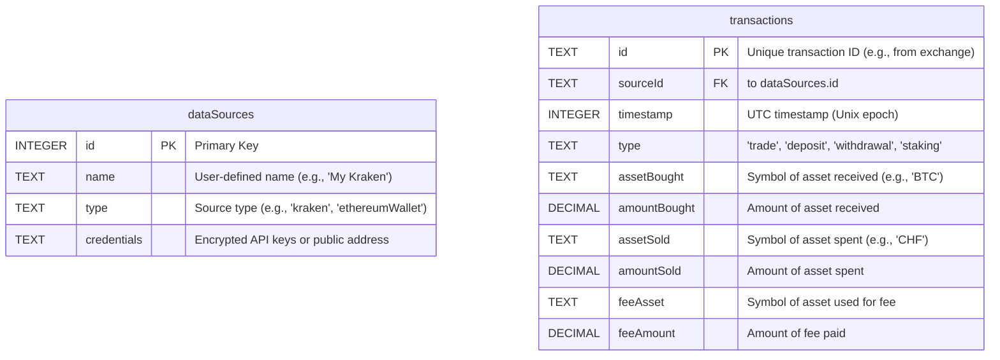

This view defines the structure of the data managed by the application. It serves as the canonical schema for the data stored in the local DuckDB database. The primary goal is to have a standardized format for all transactions, regardless of their original source.

## Schema Diagram
The data model is simple, consisting of two main independent tables: `dataSources` to store user configuration and `transactions` to store all financial events.

## Table Definitions

### `dataSources`
This table stores the user's configured data sources, such as exchange connections or wallet addresses.

| Column | Data Type | Description |
| :--- | :--- | :--- |
| `id` | INTEGER | A unique identifier for the data source (Primary Key). |
| `name` | TEXT | A user-friendly name for the source (e.g., "My Coinbase Pro"). |
| `type` | TEXT | The type of the source, used to select the correct plugin (e.g., `kraken`, `ethereum_wallet`). |
| `credentials` | TEXT | The encrypted credentials (API key/secret) or public address for the source. |

### `transactions`
This is the central table of the application, storing every financial event in a standardized format.

| Column | Data Type | Description |
| :--- | :--- | :--- |
| `id` | TEXT | The unique ID for the transaction, ideally from the source exchange (Primary Key). |
| `sourceId`| INTEGER | The ID of the data source this transaction came from (Foreign Key). |
| `timestamp` | INTEGER | The exact time of the transaction as a UTC Unix epoch timestamp. |
| `type` | TEXT | The standardized transaction type (e.g., `trade`, `deposit`, `withdrawal`, `staking`). |
| `assetBought`| TEXT | The ticker symbol of the asset that was received. Can be NULL. |
| `amountBought`| DECIMAL | The quantity of the asset received. High precision. |
| `assetSold`| TEXT | The ticker symbol of the asset that was disposed of. Can be NULL. |
| `amountSold` | DECIMAL | The quantity of the asset disposed of. High precision. |
| `feeAsset` | TEXT | The ticker symbol of the asset used to pay the transaction fee. |
| `feeAmount`| DECIMAL | The quantity of the fee paid. High precision. |
