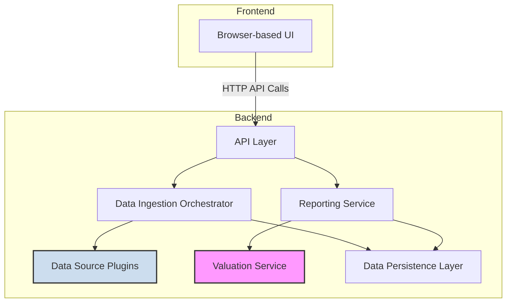

# Logical View
This view describes the key functional components of the system and their responsibilities.

| Component | Responsibility | Key Technology / Pattern |
| :--- | :--- | :--- |
| **Browser-based UI** | Renders UI, captures user input, communicates with the backend API. | Single Page Application (SPA) |
| **API Layer** | Exposes a local REST API for the frontend, routes requests. | FastAPI / Flask |
| **Data Ingestion Orchestrator**| Manages and calls the appropriate data source plugin to fetch data. | Strategy Design Pattern |
| **Data Source Plugins** | **(Pluggable)** Connects to a specific external API, fetches raw data, and normalizes it into the standard application format. | Strategy Design Pattern |
| **Reporting Service** | Calculates balances and generates final wealth/income reports from the standardized data. | Business Logic |
| **Valuation Service** | **(Pluggable)** Provides asset prices based on country-specific rules. | Strategy Design Pattern |
| **Data Persistence Layer** | Manages reading/writing all application data to local storage. | SQLite / Encrypted File |

## Data Persistence Technology
This section details why **DuckDB** was choosen as the technology for the **Data Persistence Layer**.

### Decision Criteria
The database choice is driven by the application's nature as a local, single-user desktop tool. The most important criteria are:
- **Serverless (Embedded):** The database must not require a separate server process or any configuration by the end-user. It must be a library that the Python backend uses directly.
- **Performance at Scale:** It must easily handle and perform fast queries over tens or even hundreds of thousands of transaction records without noticeable delay.
- **Python Ecosystem:** It must have mature, well-documented, and easy-to-use support in Python.
- **Simplicity & Portability:** The entire database should be contained in a single file, making it trivial for a user to locate and back up their application data.

### Database Options Considered

| Database | How it Works | Pros | Cons |
| :--- | :--- | :--- | :--- |
| **SQLite** | A self-contained, serverless SQL database engine. It reads and writes directly to a single disk file. | **Extremely stable** and reliable. Built into Python's standard library (`sqlite3`), so no extra installation is needed. Excellent for general-purpose storage. | While fast, it's not specifically optimized for the complex analytical queries (e.g., `SUM`, `GROUP BY` over large datasets) needed for reporting. |
| **DuckDB** | A serverless, embedded SQL database engine specifically designed for fast analytical queries (OLAP). | **Exceptional performance** for data analysis and aggregation, often significantly faster than SQLite for reporting queries. Has first-class integration with Pandas DataFrames. | Requires an external library (`pip install duckdb`). It is a newer project than SQLite, though very mature and widely trusted in the data science community. |
| **TinyDB** | A lightweight, document-oriented database written in pure Python. Stores data in a simple JSON file. | Very simple, Pythonic query API. No SQL required. | **Poor performance at scale**. As a plain text file, it becomes very slow to query as the number of transactions grows, as the entire file must be read and parsed for most queries. |

### Recommendation and Justification
While SQLite is a safe default, DuckDB is the optimal choice for this application's specific needs based on the following criteria:
- **Analytical Performance:** The application's most intensive task is generating tax reports, which requires fast aggregation and analysis of thousands of transactions. DuckDB is an embedded database specifically optimized for these analytical queries (OLAP) and will significantly outperform general-purpose alternatives as the dataset grows.
- **Serverless and Portable:** Like SQLite, DuckDB is serverless and stores the entire database in a single file. This requires zero configuration from the end-user and makes backing up data trivial.
- **Deep Python Integration:** DuckDB's first-class support for direct, zero-copy operations on Pandas DataFrames is a major advantage. Since the backend will heavily use Pandas for data manipulation, this simplifies code and boosts performance.
