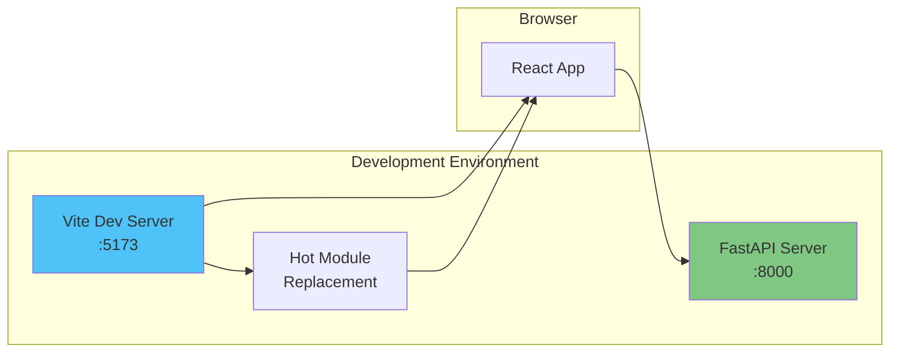
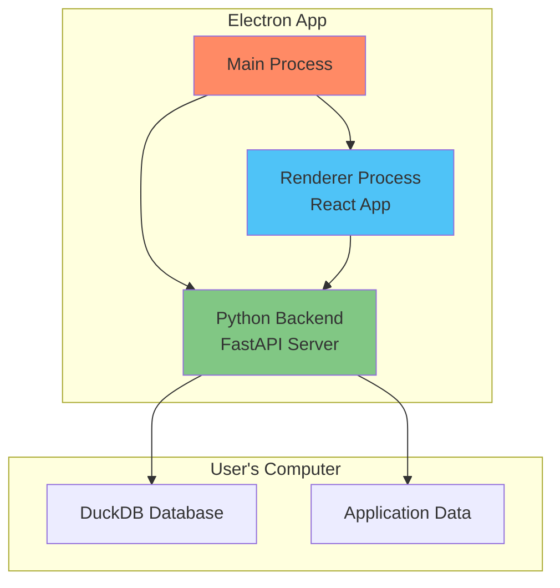

This view describes the deployment topology and runtime architecture. For this application, the topology is simple yet modern.

## Deployment Architecture

- The entire system runs on a **single machine (the user's computer)**.
- The application will be packaged into a single executable file using **Electron**.
- When launched, this executable starts two main processes:
    - The **Python Backend Server** process (FastAPI server).
    - The **Electron Renderer** process, which loads the React frontend and communicates with the backend's local API.
- All communication happens over `localhost`, requiring no external network access except for fetching data from exchange/price APIs.

## Development Architecture

## Production Architecture

## Runtime Characteristics

- **Development:** Vite dev server (port 5173) + FastAPI server (port 8000) with hot reload
- **Production:** Single Electron executable with embedded React build and Python runtime
- **Data Storage:** Local DuckDB file in user's application data directory
- **Network:** Local HTTP communication only, external APIs for data fetching
- **Performance:** Native desktop performance with modern web technologies
