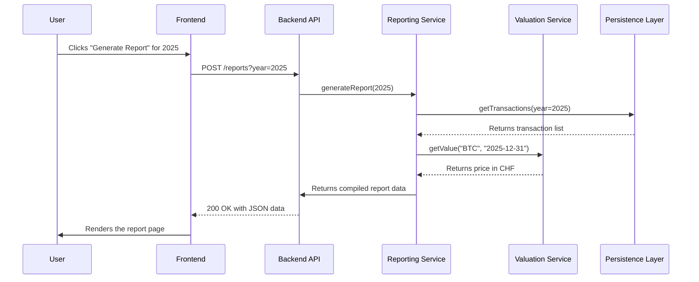

This view illustrates how the components interact at runtime. The following sequence diagram shows the process for generating a tax report.

```mermaid
sequenceDiagram
    participant User
    participant Frontend
    participant Backend API
    participant Reporting Service
    participant Valuation Service
    participant Persistence Layer

    User->>Frontend: Clicks "Generate Report" for 2025
    Frontend->>Backend API: POST /reports?year=2025
    Backend API->>Reporting Service: generateReport(2025)
    Reporting Service->>Persistence Layer: getTransactions(year=2025)
    Persistence Layer-->>Reporting Service: Returns transaction list
    Reporting Service->>Valuation Service: getValue("BTC", "2025-12-31")
    Valuation Service-->>Reporting Service: Returns price in CHF
    Reporting Service->>Backend API: Returns compiled report data
    Backend API-->>Frontend: 200 OK with JSON data
    Frontend->>User: Renders the report page
```
